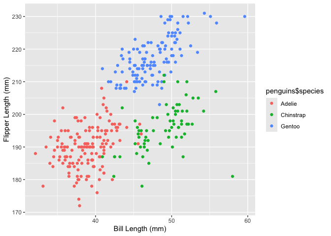

p8105_hw1_yc4585
================
2024-09-12

## Problem 1

### Load dataset

``` r
  data("penguins", package = "palmerpenguins")
  str(penguins)
  nrow(penguins)
  ncol(penguins)
  number_mean = mean(penguins$flipper_length_mm, na.rm = TRUE)
```

The the main variables in the dataset include species, island,
bill_length_mm, bill_depth_mm, flipper_length_mm, body_mass_g, sex and
year.

The dataset have 344 rows and 8 columns, the mean of flipper length is
200.9152047.

### Draw sactterplot

``` r
library(ggplot2)
plot_data = data.frame(
  x = penguins$bill_length_mm,
  y = penguins$flipper_length_mm
)

ggplot(plot_data, aes(x=x, y=y, colour = penguins$species)) + 
  geom_point() +
  labs(x = "Bill Length (mm)", y = "Flipper Length (mm)")
```

<!-- -->

``` r
ggsave(
  filename = "penguins.png", 
  width = 7,                     
  height = 7,                    
  units = "in",                   
  dpi = 600                      
)
```

## Problem 2

### Create data frame

``` r
  library(tidyverse)
```

``` r
  vec_numeric = rnorm(10,0,1)
  vec_logical = vec_numeric > 0
  vec_character = c("my","name","is","yuhao","chang","I","like","playing","the","guitar")
  pre_factor = c("A", "A", "A", "A", "A", "A", "B", "B", "C", "C")
  vec_factor = factor(pre_factor, levels = c("A", "B", "C"))
  my_data = data.frame(
    vec_numeric ,
    vec_logical ,
    vec_character ,
    vec_factor )
  print(my_data)
```

    ##    vec_numeric vec_logical vec_character vec_factor
    ## 1  -0.16844449       FALSE            my          A
    ## 2   0.10973114        TRUE          name          A
    ## 3  -0.30781189       FALSE            is          A
    ## 4  -0.53808231       FALSE         yuhao          A
    ## 5  -0.50722244       FALSE         chang          A
    ## 6   1.77683883        TRUE             I          A
    ## 7  -0.47027669       FALSE          like          B
    ## 8   1.36543612        TRUE       playing          B
    ## 9  -0.70974766       FALSE           the          C
    ## 10 -0.05027956       FALSE        guitar          C

The code above shows the required data frame.

### Calculate the mean of each variable

``` r
Vec_Numeric = my_data %>% pull(vec_numeric)
mean(Vec_Numeric)
```

    ## [1] 0.0500141

``` r
Vec_Logical = my_data %>% pull(vec_logical)
mean(Vec_Logical)
```

    ## [1] 0.3

``` r
Vec_Character = my_data %>% pull(vec_character)
mean(Vec_Character)
```

    ## Warning in mean.default(Vec_Character): argument is not numeric or logical:
    ## returning NA

    ## [1] NA

``` r
Vec_Factor = my_data %>% pull(vec_factor)
mean(Vec_Factor)
```

    ## Warning in mean.default(Vec_Factor): argument is not numeric or logical:
    ## returning NA

    ## [1] NA

We can calculate the mean of numeric variables and logical variables,
when calculating the mean of logical variables, TRUE is treated as 1 and
FALSE is treated as 0. But we cannot calculate the mean of character
variables and factor variables.

### Apply as.numeric function

``` r
num_logical = as.numeric(Vec_Logical)
num_character = as.numeric(Vec_Character)
num_factor = as.numeric(Vec_Factor)
```

For logical variables, TRUE is converted to 1 and FALSE is converted to
0. For character variables, this conversion results in NA values,
suggesting character strings cannot be directly converted to numbers.
For factor variables, the results can be converted to numbers and
different levels of factors have different numbers.

When we calculate the mean of variables, R can compute the mean for
numeric and logical types directly. However, character and factor types
require conversion. Even after conversion, we cannot calculate the mean
of character types, as this results in NAs.
